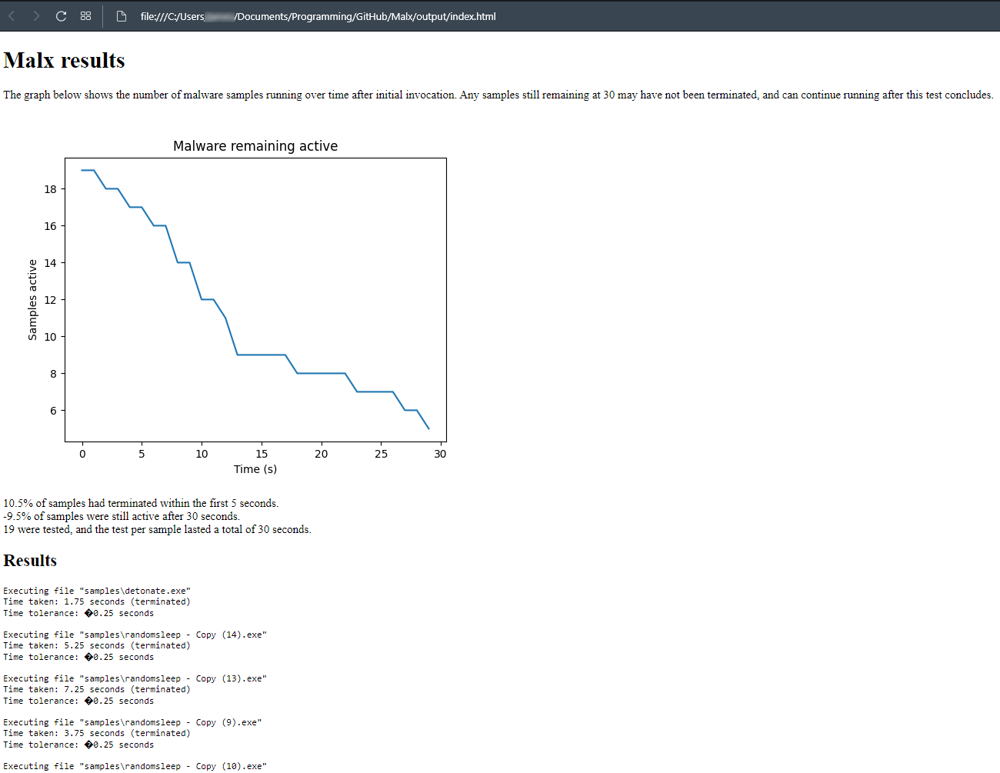

# Malx - Automatic malware executer
An automatic mass sample (malware) execution that is based on Malx used by [PC Security Channel (YouTube)](https://thepcsecuritychannel.com), designed to test an antivirus over a number of samples. This tool has been tested and designed to run on Windows.

This tool is multi-threaded and allows for the tracking of the execution of large numbers of malware samples.
## Setup
Dependencies needing to be installed can be found in `requirements.txt` and installed with `pip install -r requirements.txt`.
Then, simply run with `python malx.py --help` (or `py malx.py --help`) for the supported commands.

## Example result

Note: To save this file upon completion, specify an output folder (`--output output/`)

## In-built options

```
Options:
    -h, --help      Show this help menu
    -v, --version   Show version
    -f, --file      File to launch
    -d, --directory Directory from which to launch files (only in the first level)
    -r, --recursive Recursively launch files from any depth within a folder
    -e, --extension Extension to filter by (default: all)
    -t, --thread    Number of threads to use for launching the files every {TIME_DELAY} seconds (default 1)
    -l, --log       Save the output log (default: none)
    -o, --output    Output folder to write details to, previous details will be overwritten, only applicable to directory and recursive modes (default: none)

ie.
    py malx.py -d samples/ -e .txt
```

## Recommended usage

1. Create a folder called `samples/`.
2. Paste all your malicious exes into this folder.
3. Run `py malx.py -e .exe -d samples/` (Run exe files in the folder called samples). If you're not sure how many threads to specify, keep it as  default (1), and increase if the CPU can be utilised further.
4. Wait for the results.

## Constants

While most settings can be edited by specifying them when running the command, some less important constants are located in CAPS near the top of the `malx.py` file.

## Disclaimer
Do not use this tool to run malware on your main machine. A virtual machine should be used.
Use at your own risk.

Some sources of error may occur if you select too many threads when running the program. If you find the vm constantly on 100% CPU usage, then the number of threads is too high.

## Credits
Built by Infinity#1056 (Discord), inspired by the program used by [The PC Security Channel](https://thepcsecuritychannel.com).
