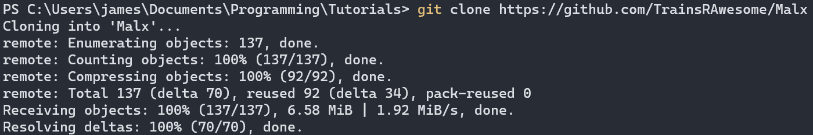
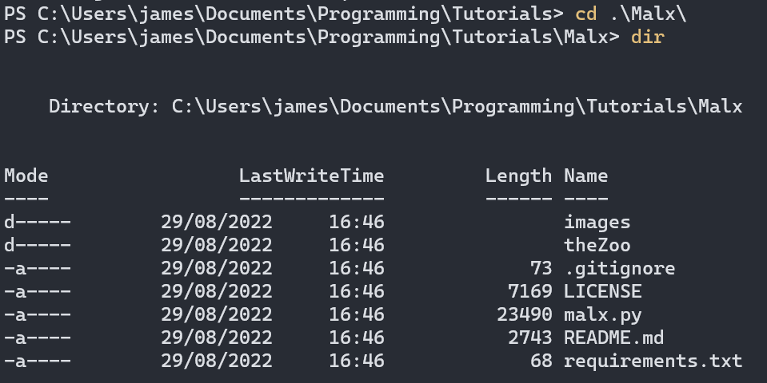
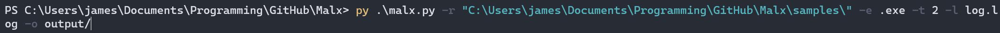

# Automatic malware executer and antivirus tester
An automatic mass sample (malware) execution that is based on Malx used by [PC Security Channel (YouTube)](https://thepcsecuritychannel.com), designed to test an antivirus over a number of samples. This tool has been tested and designed to run on Windows.

This tool is multi-threaded and allows for the tracking of the execution of large numbers of malware samples.
## Setup
Dependencies needing to be installed can be found in `requirements.txt` and installed with `pip install -r requirements.txt`. Git should also be installed.
Then, simply run with `python malx.py --help` (or `py malx.py --help`) for the supported commands.

Note: Python3 is required. On linux, `python` may default to Python2. Use `python3 malx.py --help` for more info.

Note: This tool was designed in an earlier version of python3, and has been updated to use Python 3.13 and newer package versions. If you encounter an issue installing or running due to compatibility issues with this upgrade, please create an issue in this repository.

Note: This program does not virtualise the running of samples. Use a virtual machine with the Operating System of choice that the malware you're testing runs on. Testing malware not designed to be run on that particular operating system will render the results invalid.

## Example result

Note: To save this file upon completion, specify an output folder (`--output output/`)

## In-built options

```
Options:
    -h, --help      Show this help menu
    -v, --version   Show version
    -f, --file      File to launch
    -d, --directory Directory from which to launch files (only in the first level)
    -r, --recursive Recursively launch files from any depth within a folder
    -e, --extension Extension to filter by (default: all)
    -t, --thread    Number of threads to use for launching the files every {TIME_DELAY} seconds (default 1)
    -l, --log       Save the output log (default: none)
    -o, --output    Output folder to write details to, previous details will be overwritten, only applicable to directory and recursive modes (default: none)

ie.
    py malx.py -d samples/ -e .txt
```

## How to use 
1) Open your terminal of choice (cmd/ps) and navigate to a place that you wish to clone the repository in
2) Clone the repository 
3) Navigate into the directory (you could now run `py malx.py` to see the help message) 
### Option A - Bulk execute a number of samples
4. a. Use the `-r` option and point it to the folder containing the samples (as a rule of thumb, use `-r` instead of `-d` as it can be used in more use cases) 
### Option B - Execute a standalone sample 
4. b. Use the `-f` option like so: 
### Option C - Bulk execute files from the theZoo repository (a malware repository)
4. c. Just simply write it like below, and follow the on-screen prompts (this feature is a work-in-progress) 

5. By default, you don't actually see that much information without specifying additional arguments, and you can also modify some functionality by using the options below:

`-e, --extension <file extension to filter by>` - Extension to filter by (default: all, applies to -r and -d modes)

`-t, --thread <number of threads>` - Number of files launched every 5 seconds (default 1, applies to -r, -d and -z modes)

`-l, --log <log filename>` - Saves an additional log log (default: none)

`-o, --output <relative folder path>` - Using this generates a folder with an enclosed document detailing how the bulk execution of files progressed, like so: 
This is one of the most useful flags (applies to -r, -d and -z modes).

A command fully utilising all the options above would look like this: 

If you have any more questions, contact me on discord (codebyte).

## Troubleshooting

- `ModuleNotFound` error - hopefully you read the instructions and installed the dependencies from `requirements.txt`. If you have, install the module named as not found via pip (`pip3 install <module_name>` - pip or pip3-for linux), and try again

- `python/py/python3 not found` - make sure python is added to path, and make sure you are using the correct choice from `python/py/python3` as not all keywords work interchangeably in different python versions and Operating Systems. 

## Constants

While most settings can be edited by specifying them when running the command, some less important constants are located in CAPS near the top of the `malx.py` file.

## Disclaimer
Do not use this tool to run malware on your main machine. A virtual machine should be used, and you should have the knowledge to set it up correctly. If you are unsure of your ability to properly isolate the vm, do not run malware on it.
Use at your own risk.

Some sources of error may occur if you select too many threads when running the program. If you find the vm constantly on 100% CPU usage, then the number of threads is too high.

## Credits
Built by [codebyte](https://infinitydev.org.uk) (Discord), inspired by the program used by [The PC Security Channel](https://thepcsecuritychannel.com).
